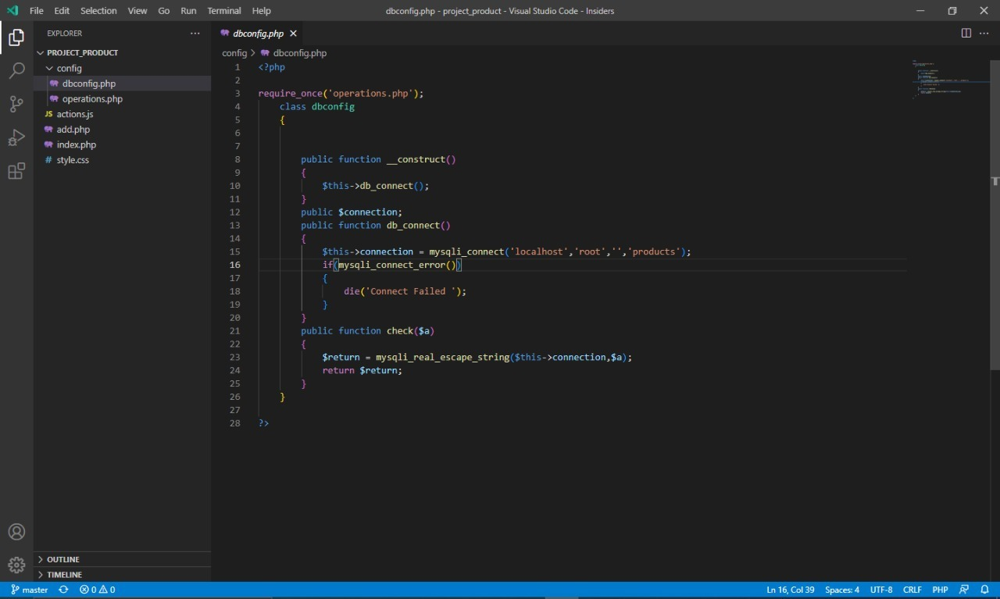

# Project_Product_PHP

## first config the file in the folder config/dbconfig.php

configure data how user address: localhost, database user: 'root', password:'empty in my case', database name:'products'

```
    line 17:  $this->connection = mysqli_connect('localhost','root','','products');
```




link database SQL only import: [product.sql](product.sql)

after import database and to make connection is ready for to use only acess index.php
